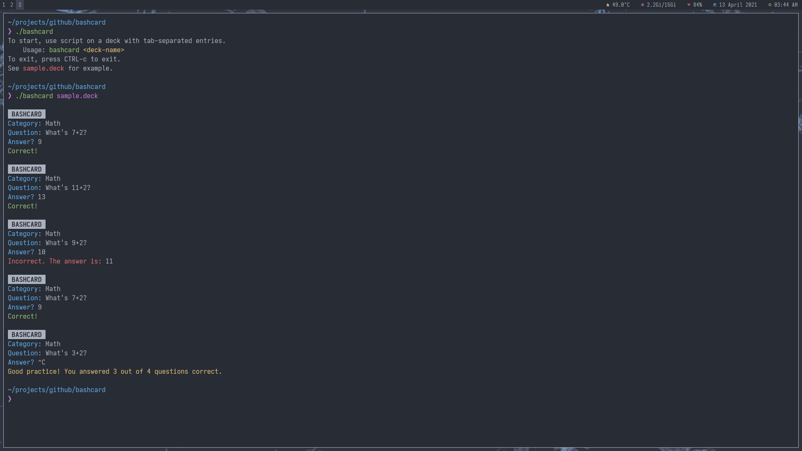

# Flashcards, but with Bash

As a student, I often find myself using flashcard-based learning applications like Anki or Quizlet to review my lessons.
However, as I have been getting more accustomed to the command line and much prefer to "live in the terminal", I wanted
a simple script to cover my flashcard needs without the use of a GUI program or a phone. Thus comes `bashcard`, a
zero-dependencies script to do just that.

## How To Use

`bashcard` is simple. Create a file, *any* file, *any* extensions, with tab separated entries that will become part of
your card. In other words, on each line of the file should be items in this order:

```
Category <Tab> Question <Tab> Answer 
```

Then, call the script with

```sh
./bashcard your.deck
```

See the [sample deck](sample.deck) and the [preview](bashcard.png) below for more help.



## How to Install

To download this script to your own machine, clone this repository with git

```sh
git clone https://github.com/ourigen/bashcard.git
```

Or, since this is just a simple Bash script, create a file on your machine named `bashcard`, copy and paste the script's
source content into it, and make the script executable

```sh
chmod +x bashcard
```

## Planned Features

This script, though functional, has room for improvements. Here are some features I'd like to implement

* [ ] Improve card algorithm
  * [ ] Hide cards already shown
	* [ ] Add point system to track difficulty of question
* [ ] Allow joining multiple decks to one session
* [ ] Add "speed" mode, where you have a time limit to answer each question

## License

This script is licensed under the [GNU General Public License](LICENSE.md).
